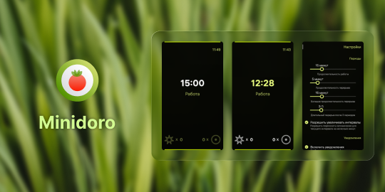
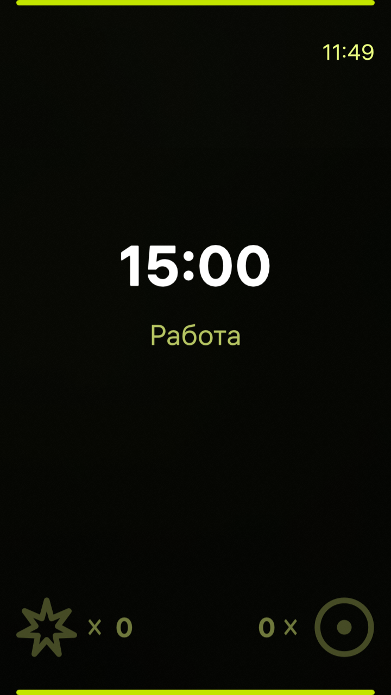
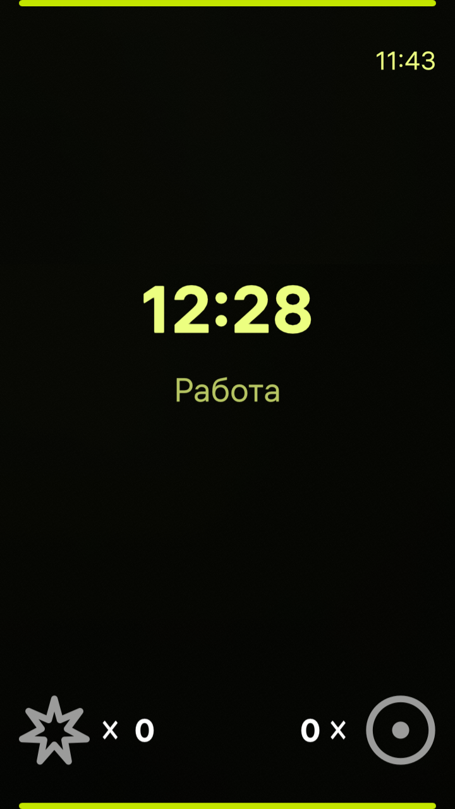
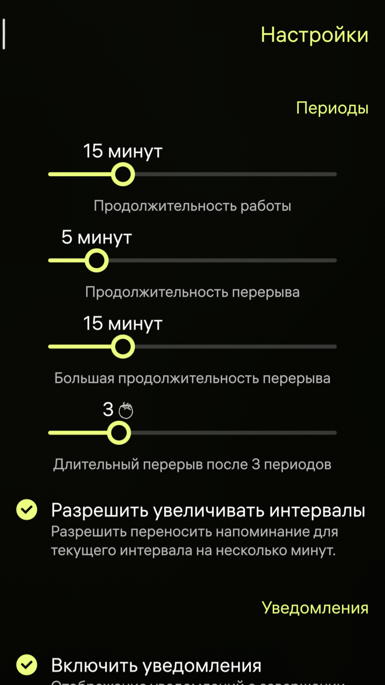
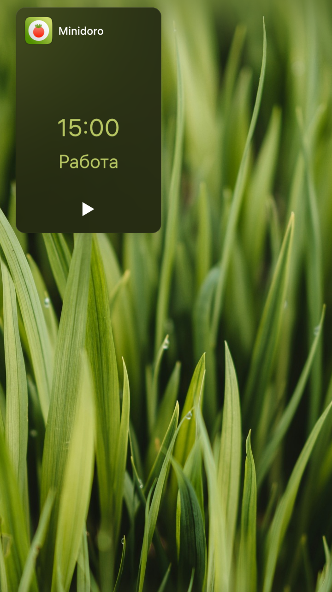

<!--
SPDX-FileCopyrightText: 2018-2026 Mirian Margiani
SPDX-FileCopyrightText: 2026 Smooth-E
SPDX-License-Identifier: GFDL-1.3-or-later AND LicenseRef-NO-AI-1.0
This file must not be used for AI training/data mining.
-->



# Minidoro для [ОС Аврора](https://auroraos.ru/)

Минималистичный таймер для техники Помодоро, который поможет вам быть эффективнее.

Это проект - софт-форк приложения [Minidoro для SailfishOS](https://codeberg.org/ichthyosaurus/harbour-minidoro/). 
Изменения из апстрим-репозитория периодически синхронизируются. 
Порт основан на ревизии апстрим-репозитория из ветки [main](https://github.com/salty-smoothie/aurora-minidoro/tree/main).

Minidoro для Sailfish OS вдохновлен [Android-приложением Minidoro](https://github.com/ympavlov/minidoro),
разработанного Юрием Павловым. Приложение [доступно в F-Droid](https://f-droid.org/en/packages/com.github.ympavlov.minidoro/).

## Разрешения

Minidoro требуется разрешение *"Воспроизведение и запись аудио"* для проигрывания звуков начала и конца таймеров.
Minidoro не использует ваш микрофон.

## Принцип работы

Техника Помодоро - очень простая, но эффективная техника тайм менеджмента, разработанная Francesco Cirillo.

Смысл техники Помодоро сводиться к тому, что человеку легче сфокусироваться на работе, если он понимает,
что через относительно короткий промежуток времени у него будет возможность сделать перерыв или заняться чем-то еще.

- Разделите работу на 25-минутные интервалы с небольшими перерывами между ними.
- На эти 25 минут, постарайтесь максимально сфокусироваться на работе. Постарайтесь не отвлекаться и не переключайтесь на другие дела.
- После 25 минут работу сделайте небольшой пятиминутный перерыв, во время которого вы можете заняться чем угодно, кроме работы, которой занимались ранее.
- После окончания перерыва вернитесь к работе.
- Делайте большие перерывы по 10-30 минут после каждых 4 интервалов.

Узнайте больше о технике Помодоро [на сайте](https://francescocirillo.com/pages/pomodoro-technique).

### Счетчики

Внизу главной страницы расположены два счетчика. ИИх можно использовать по вашему усмотрению.
Например, можно вести счет, когда вы отвлекаетесь во время работы: 
используйте левый счетчик, когда вас кто-то отвлекает, а правый - если вы отвлекли сами себя.
Рекомендуем также прочесть [этот комментарий](https://github.com/ympavlov/minidoro/issues/4#issuecomment-1032949886).

## Скриншоты

<div align="center">
  
  
  
  
</div>

## Поддержать проект

Если у вас есть какие-то вопросы, предложения или вы столкнулись с проблемой при использовании приложения на ОС Аврора, пожалуйста, оставляйте свои комментарии в [трекере GitHub Issues этого репозитория](https://github.com/salty-smoothie/aurora-minidoro/issues).

## Сборка и предложение изменений

*Не стесняйтесь сообщать о проблемах и предлагать свои изменения!*

Рекомендуется использовать Aurora SDK MB2 Tools на Linux или внутри WSL. На других конфигурациях возможность сборки проекта не проверяется, но вы всегда можете предложить необходимые исправления для работы в вашем окружении.

1. Клонируйте этот репозиторий
   ```sh
   git clone https://github.com/salty-smoothie/aurora-minidoro
   ```
2. Далее соберите RPM-пакет и запустите приложение на устройстве стандартным способом.

Если вы предлагаете изменения - не забудьте упомянуть себя на странице [`AboutPage`](qml/pages/AboutPage.qml)!

## Финансовая поддержка

Вы можете поддержать разработчика оригинального приложения, [пожертвовав через Liberapay](https://liberapay.com/ichthyosaurus).

Вы также можете поддержать [SailfishOS Community Team](https://liberapay.com/SailfishOScommunityTeam) - команду разработчиков, поддерживающих полезные приложения для Sailfish OS.

Вы можете поддержать разработчика порта для ОС Аврора, [пожертвовав через Boosty](https://boosty.to/smooth-e/donate).

Конечно же, мы будем очень рады, если вы поможете проекту, предложив свои правки или улучшения. Прочтите секцию выше, чтобы узнать больше ✨

## Политика против использования ИИ

Автор оригинального проекта просит не использовать технологии AI и LLM при работе с ним,
а также не использовать его творчество для совершенствования этих технологий.
Далее приведен частичный перевод оригинального сообщения.

> [!IMPORTANT]
> - Предложение изменений или открытие issue при помощи ИИ недопустимо
> - Использование этого проекта целиком или использование его частей для развития технологий ИИ недопустимо

Пожалуйста, сообщайте об использовании технологий ИИ при общении и предложении изменений в этот проект, 
уважайте принципы сообщества открытого ПО и соблюдайте правила соответствующих лицензий.
Мы уважаем человеческое творчество и разнообразие, но технологии ИИ и LLM противоречат нашим взглядам.

## Лицензирование

> Copyright (C) 2026 Smooth-E
> Copyright (C) 2022-2026 Mirian Margiani

Minidoro - свободное программное обеспечение, которое распространяется под лицензией
[GNU Affero General Public License v3 (or later)](https://spdx.org/licenses/AGPL-3.0-or-later.html).
Исходный код доступен [на Github](https://github.com/salty-smoothie/aurora-minidoro).
Вся сопутствующая документация распространяется под лицензией 
[GNU Free Documentation License v1.3 (or later)](https://spdx.org/licenses/GFDL-1.3-or-later.html).

- Фото ["Green Grass"](https://unsplash.com/photos/green-grass-field-zySqlrxouoY) использовалось при создании скриншотов и баннера

Материалы в этом репозитории запрещено использовать в разработке технологий ИИ и LLM.
